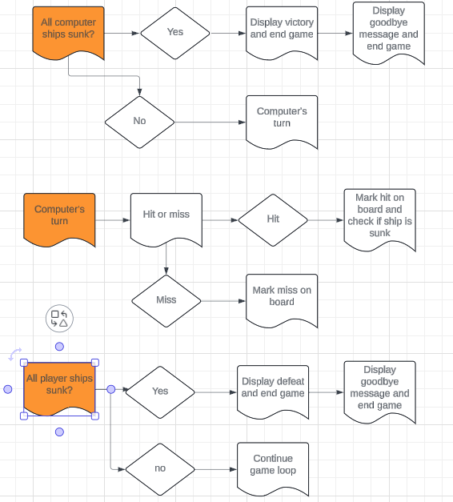
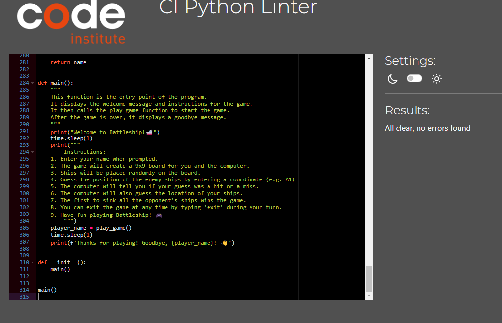

# Battleship Game

This Battleship game is a console-based implementation of the classic board game where two players (a human and a computer) take turns guessing the locations of each other's ships on a 9x9 grid. The first player to sink all of the opponent's ships wins the game.

## Table of Contents

1. [How to Play](#how-to-play)
2. [How it Works](#how-it-works)
3. [Why This Implementation](#why-this-implementation)
4. [Deployment](#deployment)
5. [Testing](#testing)
6. [Future Improvements](#future-improvements)

## How to Play

1. **Start the Game**: Run the script to start the game.
2. **Enter Your Name**: You will be prompted to enter your name.
3. **Game Setup**: The game will create a 9x9 board for both you and the computer and place ships randomly.
4. **Take Turns**:
    - You will guess the location of the computer's ships by entering coordinates (e.g., A1).
    - The computer will also make guesses to find your ships.
5. **Game End**: The game ends when either you or the computer has sunk all of the opponent's ships.
6. **Exit**: You can exit the game at any time by typing 'exit' during your turn.

## How it Works

### Game Initialization

- The game begins by displaying a welcome message and instructions.
- Players are prompted to enter their name, which is validated to ensure it is non-empty and does not start with a number.
- Both the player and computer boards are created as 9x9 grids.
- Ships are randomly placed on both boards using the `place_ships` function.

### Main Game Loop

- The player is asked to enter a guess (e.g., A1). The input is validated to ensure it is within the correct format and range.
- The guess is processed:
  - If it's a hit, the board is updated, and the game checks if any ship has been completely sunk.
  - If it's a miss, the board is updated accordingly.
- The computer then makes a random guess on the player's board.
- The game continues until all ships of either the player or the computer are sunk.

### Ending the Game

- The game ends when all ships of either the player or the computer are sunk.
- A victory or defeat message is displayed, and the total number of guesses is shown.

## Why This Implementation

- **Simplicity**: The console-based implementation focuses on core gameplay mechanics without the need for a graphical user interface.
- **Random Ship Placement**: Ensures a different game experience each time by placing ships randomly.
- **Turn-based Mechanics**: Mimics the classic Battleship game, providing a familiar and engaging experience.
- **Input Validation**: Ensures user inputs are correct, enhancing the robustness of the game.


2. **Install Python**: Ensure you have Python installed on your system. The game is compatible with Python 3.x.

3. **Run the Game**: Execute the script to start the game.

    ```sh
    python battleship.py
    ```

## Future Improvements

1. **Enhanced AI**: Implement a more sophisticated AI for the computer player to make smarter guesses.
2. **Graphical User Interface**: Develop a GUI version of the game to make it more visually appealing and user-friendly.
3. **Multiplayer Mode**: Add a feature to allow two human players to play against each other, either locally or over the internet.
4. **Customizable Board Size and Ships**: Allow players to customize the board size and the number and size of ships.
5. **Save and Load Game**: Implement functionality to save the current game state and load it later.

---

## Flow




## Technologies

- Python - Python is what this program is built in.
- Emojis - In requirements there is an module needed to install for the game to function, pip install emoji

## Testing

Below are the execution tests that are done to this app.

### Functional Testing

| Description                 | Steps                                    | Expected                                                                                                                   | Actual                                                                                                                     | Pass |
| --------------------------- | ---------------------------------------- | -------------------------------------------------------------------------------------------------------------------------- | -------------------------------------------------------------------------------------------------------------------------- | ---- |
| Open app                    | Run the program                          | Welcome message, instructions and "Enter your name"                                                                        | Welcome message instructions and "Enter your Name"                                                                         | Pass |
| Enter your name             | Type in your name                        | See "Press enter to start the game"                                                                                        | Sees "Press enter to start the game                                                                                        | Pass |
| Press enter                 | Press Enter                              | Outputs "placing ships on the board...Wave emojis x5" and loades player board with 5 different ships placed at random      | Outputs "placing ships on the board...Wave emojis x5" and loades player board with 5 different ships placed at random      | Pass |
| Missed guess                | Enter an e.g A1 Guess                    | Outputs Player missed enemy ship and marks the computer board with an M for miss on input location                         | Outputs Player missed enemy ship and marks the computer board with an M for miss on input location                         | Pass |
| Guess hit                   | Enter an e.g A1 Guess                    | Outputs Player hit an enemy ship, Marks computer board with an X on input location                                         | Outputs Player hit an enemy ship, Marks computer board with an X on input location                                         | Pass |
| Invalid guess               | Enter an invalid guess e.g m5            | Outputs "invalid input. Please enter a valid guess"                                                                        | Outputs "invalid input. Please enter a valid guess"                                                                        | Pass |
| Already made guess          | Enter an already made guess e.g A1 twice | Outputs you have already guess the coordinate. try again                                                                   | Outputs you have already guess the coordinate. try again                                                                   | Pass |
| Computer guess miss         | Computer missed                          | Outputs the coordinate for computer guess "Enemy missed you ship" Enemy guess e.g f7 Marks player board with an M for miss | Outputs the coordinate for computer guess "Enemy missed you ship" Enemy guess e.g f7 Marks player board with an M for miss | Pass |
| Computer guess hit          | Computer hit                             | Outputs the coordinate for computer guess "Enemy hit your ship" Enemy guess e.g f7 Marks player board with an X for hit    | Outputs the coordinate for computer guess "Enemy hit your ship" Enemy guess e.g f7 Marks player board with an X for hit    | Pass |
| Player Sunk destroyer ship  | Sink a destryoer                         | Outputs Player hit an enemy ship, Outputs Player sunk the enemy's Destroyer                                                | Outputs Player hit an enemy ship, Outputs Player sunk the enemy's Destroyer                                                | Pass |
| Player Sunk Crusier ship    | Sink a Crusier                           | Outputs Player hit an enemy ship, Outputs Player sunk the enemy's Crusier                                                  | Outputs Player hit an enemy ship, Outputs Player sunk the enemy's Crusier                                                  | Pass |
| Player Sunk Submarine       | Sink a Submarine                         | Outputs Player hit an enemy ship, Outputs Player sunk the enemy's Submarine                                                | Outputs Player hit an enemy ship, Outputs Player sunk the enemy's Submarine                                                | Pass |
| Player Sunk Battleship      | Sink a Battleship                        | Outputs Player hit an enemy ship, Outputs Player sunk the enemy's Battleship                                               | Outputs Player hit an enemy ship, Outputs Player sunk the enemy's Battleship                                               | Pass |
| player Sunk Carrier         | Sink a Carrier                           | Outputs Player hit an enemy ship, Outputs Player sunk the enemy's Carrier                                                  | Outputs Player hit an enemy ship, Outputs Player sunk the enemy's Carrier                                                  | Pass |
| Compter Sunk destroyer ship | Computer sunk a Destroyer                | Outputs Enemy hit your ship, Outputs The computer sunk your Destroyer                                                      | Outputs Enemy hit your ship, Outputs Enemy sunk your Destroyer                                                             | Pass |
| Computer Sunk Crusier ship  | Computer sunk a Crusier                  | Outputs Enemy hit your ship, Outputs The computer sunk your Crusier                                                        | Outputs Player hit an enemy ship, Outputs Player sunk the enemy's Crusier                                                  | Pass |
| Computer Sunk Submarine     | Computer sunk a Submarine                | Outputs Enemy hit your ship, Outputs The computer sunk your Submarine                                                      | Outputs Player hit an enemy ship, Outputs Player sunk the enemy's Submarine                                                | Pass |
| ComputerSunk Battleship     | Computer sunk a Battleship               | Outputs Enemy hit your ship, Outputs The computer sunk your Battleship                                                     | Outputs Player hit an enemy ship, Outputs Player sunk the enemy's Battleship                                               | Pass |
| Computer Sunk Carrier       | Computer sunk a Carrier                  | Outputs Enemy hit your ship, Outputs The computer sunk your Carrier                                                        | Outputs Player hit an enemy ship, Outputs Player sunk the enemy's Carrier                                                  | Pass |
| All player ships sunk       | Computer sinks all the players ships     | Outputs Defeat! The enemy sunk all your ships. You lose                                                                    | Outputs Defeat! The enemy sunk all your ships. You lose                                                                    | Pass |
| All computer ships sunk     | The player sinks all enemy ship          | Outputs Victory! You sunk all the enemy 's ships. You win!                                                                 | Outputs Victory! You sunk all the enemy 's ships. You win!                                                                 | Pass |
| Exit game on turn           | type exit on your turn                   | Outputs Quitting the game...Traitor Thanks you playing! Goodbye Player                                                     | Outputs Quitting the game...Traitor Thanks you playing! Goodbye Player                                                     | Pass |


### PEP8 Validator



All python code was tested in (https://pep8ci.herokuapp.com/#) with no errors

## Deployment

### Version Control
The site was created using the Visual Studio Code editor and pushed to github to the remote repository Battleship_PP3_CI

The following git commands were used throughout development to push code to the remote repo:


```git commit -m "commit message"``` - This command was used to commit changes to the local repository queue ready for the final step.

```git push``` - This command was used to push all committed code to the remote repository on github.

### Heroku Deployment

The below steps were followed to deploy this project to Heroku:

- Go to Heroku and click "New" to create a new app.
- Choose an app name and region region, click "Create app".
- Navigate to Buildpacks and add buildpacks for Python and NodeJS (in that order).
- Navigate to "Deploy". Set the deployment method to Github and enter repository name and connect.
- Scroll down to Manual Deploy, select "main" branch and click "Deploy Branch".
- The app will now be deployed to heroku

### Clone Locally

- Open IDE of choice and type the following into the terminal:
     ```git clone https://github.com/OscarBackman92/Battleship_PP3_CI```
- Project will now be cloned locally.

## Credits

- Google was used for inspiration and research on how to build a battleship game
- Gareth McGirr - (https://github.com/Gareth-McGirr/motorcycle-rental-management) for readme tips.
- Sweden Community slack group for tips and inspiration.
- W3C tutorials were used as a reference for python functions throughout this project.
- Last but definetly not the least Dasiy McGirr my mentor doe putting up with me.

## Thank you

Thank you for playing Battleship! If you have any suggestions or feedback, feel free to contribute or open an issue on the GitHub repository.
