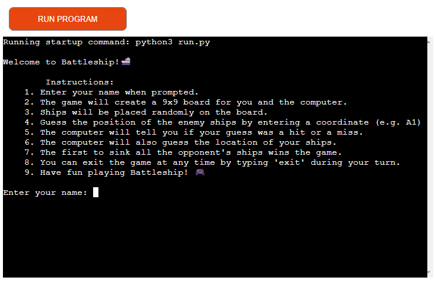
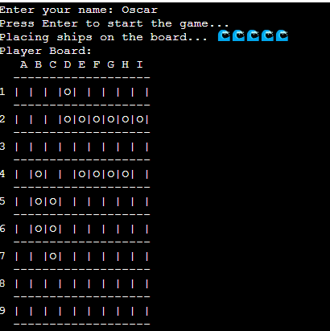
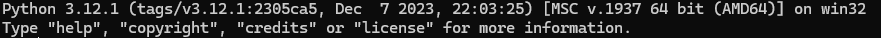

# Battleship Game

## Introduction

Welcome to Battleship! This classic naval combat game pits you against the computer in a battle to sink each other's ships. In Battleship, strategy and deduction are key to victory. Are you ready to command your fleet and outmaneuver your opponent?

## Features

- **Dynamic Board**: The game generates a 9x9 board where you and the computer will place your ships and make guesses.
- **Randomized Ship Placement**: Ships are placed randomly on the board, adding an element of unpredictability to each game.
- **Hit or Miss Feedback**: After each guess, the game provides immediate feedback on whether your shot was a hit or a miss.
- **Ship Sinking**: Sink your opponent's ships by landing hits on each part of the ship.
- **Exit Option**: You can exit the game at any time by typing 'exit' during your turn.

## How to Play

1. **Enter Your Name**:
Start by entering your name to personalize the gaming experience.

2. **Ship Placement**:
Ships are automatically placed on the board for both you and the computer.

3. **Make Guesses**:
Guess the positions of your opponent's ships by entering coordinates in the format `A1`, `B2`, etc.
4. **Hit or Miss**: The game will inform you if your guess hits or misses an enemy ship.
5. **Computer's Turn**: After your turn, the computer will take its shot at your fleet.
6. **Sink Ships**: Sink all of your opponent's ships before they sink yours to win the game.

## Controls

- **Enter your guess**: Input a coordinate (e.g., `A1`, `B2`) during your turn to make a guess.
- **Exit the game**: Type 'exit' during your turn to quit the game.

## Strategy Tips

- **Strategize Ship Placement**: Disperse your ships strategically across the board to make them harder to find.
- **Use Process of Elimination**: Keep track of your opponent's misses to narrow down possible ship locations.
- **Protect Your Ships**: Defend your ships by avoiding patterns and spreading them out intelligently.

## Requirements

- 

- pip install emoji

## How to Run

1. Clone this repository to your local machine.
2. Navigate to the directory containing the `run.py` file.
3. Run the command `python run.py` to start the game.

## Have Fun!

Now that you know the rules and strategies, it's time to jump into the action-packed world of Battleship! Command your fleet, make strategic decisions, and emerge victorious. Good luck, Admiral!