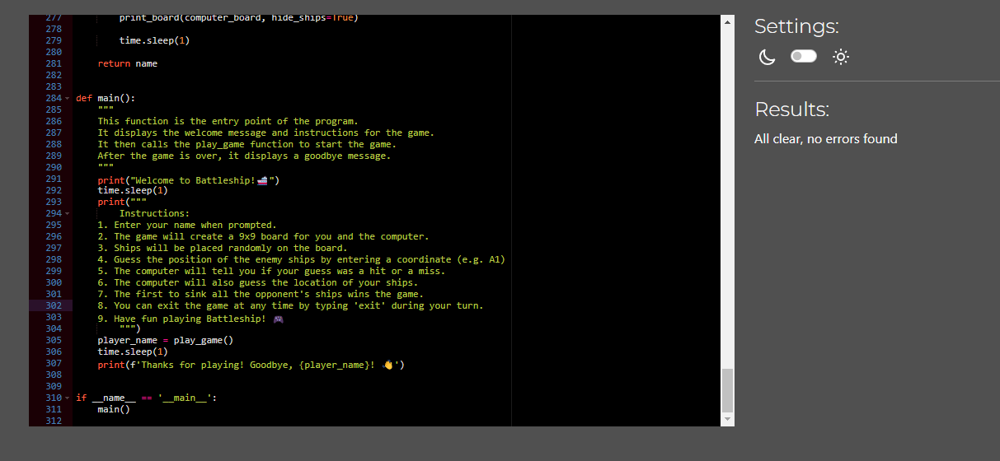

# Battleship Game


This Battleship game is a console-based implementation of the classic board game where two players (a human and a computer) take turns guessing the locations of each other's ships on a 9x9 grid. The first player to sink all of the opponent's ships wins the game.

Link to live site https://python3battleship-c25008d31b4b.herokuapp.com/

## Table of Contents

1. [Features](#features)
   - [Welcome Screen](#1-welcome-screen)
   - [Name Input](#2-name-input)
   - [Game Board Setup](#3-game-board-setup)
   - [Ship Placement](#4-ship-placement)
   - [Turn-Based Gameplay](#5-turn-based-gameplay)
   - [Hit and Miss Feedback](#6-hit-and-miss-feedback)
   - [Ship Sunk Notifications](#7-ship-sunk-notifications)
   - [Game End Conditions](#8-game-end-conditions)
   - [Exit Functionality](#9-exit-functionality)
   - [User Interaction](#user-interaction)
   - [Error Handling](#error-handling)
2. [Future Improvements](#future-improvements)
3. [How to Play](#how-to-play)
4. [How it Works](#how-it-works)
5. [Why This Implementation](#why-this-implementation)
6. [Flow Chart](#flow-chart)
7. [Technologies](#technologies)
8. [Testing](#testing)
9. [Deployment](#deployment)
10. [Credits](#credits)
11. [Thank You](#thank-you)

## Features

### 1. Welcome Screen

- **Description**: Upon starting the game, a welcome message and instructions are displayed.
- **Purpose**: Introduces the player to the game and provides initial instructions on how to play.


### 2. Name Input

- **Description**: Players are prompted to enter their name.
- **Validation**: Ensures the name is non-empty, doesn't start with a number, and is a valid string.
- **Purpose**: Personalizes the game experience and ensures valid input from the player.


### 3. Game Board Setup

- **Description**: A 9x9 grid board is created for both the player and the computer.
- **Purpose**: Sets up the game environment where ships will be placed and guesses will be made.


### 4. Ship Placement

- **Description**: Ships are randomly placed on both the player's and the computer's boards.
- **Types of Ships**:
  - Carrier (5 cells)
  - Battleship (4 cells)
  - Cruiser (3 cells)
  - Submarine (3 cells)
  - Destroyer (2 cells)
- **Purpose**: Mimics the traditional setup phase of Battleship, ensuring a unique game experience each time.


### 5. Turn-Based Gameplay

- **Player Turn**:
  - **Description**: The player enters coordinates to guess the location of the computer's ships.
  - **Validation**: Ensures the input is in the correct format (e.g., A1) and within the bounds of the board.


- **Computer Turn**:
  - **Description**: The computer randomly guesses the location of the player's ships.
- **Purpose**: Facilitates alternating turns between the player and the computer, simulating the classic Battleship gameplay.


### 6. Hit and Miss Feedback

- **Description**: Feedback is provided for each guess, indicating whether it was a hit or a miss.
- **Visual Representation**:
  - 'X' marks a hit.
  - 'M' marks a miss.
  - **Purpose**: Keeps the player informed of their progress and helps them strategize their next move.


### 7. Ship Sunk Notifications

- **Description**: Notifies the player when they have sunk one of the computer's ships and vice versa.
- **Purpose**: Adds to the excitement and progression of the game, providing a sense of achievement.


### 8. Game End Conditions

- **Description**: The game ends when all ships of either the player or the computer are sunk.
- **Victory Message**: Displayed when the player sinks all the computer's ships.
- **Defeat Message**: Displayed when the computer sinks all the player's ships.
- **Purpose**: Defines the winning and losing conditions, bringing the game to a natural conclusion.


### 9. Exit Functionality

- **Description**: Allows the player to exit the game at any time by typing 'exit'.
- **Purpose**: Provides an option for the player to quit the game gracefully if they choose to do so.


### User Interaction

- **Simple Text-Based Interface**: The game runs in the console, making it accessible and easy to play without the need for a graphical user interface.
- **Prompts and Messages**: Clear prompts and messages guide the player through each stage of the game, ensuring a smooth and engaging experience.


### Error Handling

- **Input Validation**: Ensures that all user inputs are valid and within the expected format, preventing errors and enhancing the robustness of the game.
- **Duplicate Guess Prevention**: Prevents players from guessing the same coordinate more than once, maintaining the integrity of the game.


### Future Improvements

- **Enhanced AI**: Developing a more strategic computer opponent.
- **Graphical User Interface**: Transitioning to a GUI-based version for improved user experience.
- **Multiplayer Mode**: Allowing two human players to compete against each other.
- **Customizable Game Settings**: Enabling players to customize board size, number of ships, and other game settings.
- **Save and Load Functionality**: Allowing players to save their game progress and resume later.

## How to Play

1. **Start the Game**: Run the script to start the game.
2. **Enter Your Name**: You will be prompted to enter your name.
3. **Game Setup**: The game will create a 9x9 board for both you and the computer and place ships randomly.
4. **Take Turns**:
    - You will guess the location of the computer's ships by entering coordinates (e.g., A1).
    - The computer will also make guesses to find your ships.
5. **Game End**: The game ends when either you or the computer has sunk all of the opponent's ships.
6. **Exit**: You can exit the game at any time by typing 'exit' during your turn.

## How it Works

### 1. Imports and Emoji Initialization

The Python code imports necessary modules like `random`, `re`, `time`, and `emoji` for functionality. It also initializes emoji support.

### 2. Global Ship Definitions

The `ships` dictionary defines the ships used in the game along with their sizes.

### 3. Board Creation Function

The `create_board()` function creates a 9x9 empty board with all cells initialized to empty spaces.

### 4. Board Printing Function

The `print_board()` function prints the game board with row numbers on the left and column letters on the top. It optionally hides ships when `hide_ships` parameter is set to True.

### 5. Ship Placement Function

The `place_ships()` function randomly places ships on the board, ensuring they don't overlap or go out of bounds.

### 6. Input Validation Functions

The `validate_input()` and `validate_name()` functions validate user input for guess and name respectively.

### 7. Computer Guess Function

The `computer_guess()` function generates a random guess for the computer player.

### 8. Ship Sunk Check Function

The `is_ship_sunk()` function checks if a specific ship has been sunk by the opponent.

### 9. Game Loop Function

The `play_game()` function is the main game loop where players take turns guessing each other's ships until all ships of one player are sunk.

### 10. Main Function

The `main()` function is the entry point of the program. It displays the welcome message, instructions, and calls `play_game()` to start the game.

### Game Initialization

- The game begins by displaying a welcome message and instructions.
- Players are prompted to enter their name, which is validated to ensure it is non-empty and does not start with a number.
- Both the player and computer boards are created as 9x9 grids.
- Ships are randomly placed on both boards using the `place_ships` function.

### Main Game Loop

- The player is asked to enter a guess (e.g., A1). The input is validated to ensure it is within the correct format and range.
- The guess is processed:
  - If it's a hit, the board is updated, and the game checks if any ship has been completely sunk.
  - If it's a miss, the board is updated accordingly.
- The computer then makes a random guess on the player's board.
- The game continues until all ships of either the player or the computer are sunk.

### Ending the Game

- The game ends when all ships of either the player or the computer are sunk.
- A victory or defeat message is displayed, and the total number of guesses is shown.

## Why This Implementation

- **Simplicity**: The console-based implementation focuses on core gameplay mechanics without the need for a graphical user interface.
- **Random Ship Placement**: Ensures a different game experience each time by placing ships randomly.
- **Turn-based Mechanics**: Mimics the classic Battleship game, providing a familiar and engaging experience.
- **Input Validation**: Ensures user inputs are correct, enhancing the robustness of the game.

## Flow Chart


## Technologies

- Python: Python is what this program is built with, and I used several standard Python libraries and one external library for the program.
  - Random: To place ships on the board at random.
  - Re: Used to validate user inputs.
  - Time: Used to delay computer response for better user experience.
  - emoji: To display emojis in the console game.

## Testing

### Functional testing

| Description                 | Steps                                    | Expected                                                                                                                   | Actual                                                                                                                     | Pass |
| --------------------------- | ---------------------------------------- | -------------------------------------------------------------------------------------------------------------------------- | -------------------------------------------------------------------------------------------------------------------------- | ---- |
| Open app                    | Run the program                          | Welcome message, instructions and "Enter your name"                                                                        | Welcome message instructions and "Enter your Name"                                                                         | Pass |
| Enter your name             | Type in your name                        | See "Press enter to start the game"                                                                                        | Sees "Press enter to start the game                                                                                        | Pass |
| Enter you name Empty        | Just press enter                         | Invalid Name. Please enter valid name                                                                                      | Invalid Name. Please enter valid name                                                                                      | Pass |
| Enter your name 3 spaces    | Press space three times and then enter   | Invalid Name. Please enter valid name                                                                                      | Invalid Name. Please enter valid name                                                                                      | Pass |
| Enter name numbers          | Enter numbers for name                   | Invalid Name. Please enter valid name                                                                                      | Invalid Name. Please enter valid name                                                                                      | Pass |
| Enter name then numbers     | enter your name and numbers              | Outputs"Press enter to start game"                                                                                         | Outputs"Press enter to start game"                                                                                         | Pass |
| Press enter                 | Press Enter                              | Outputs "placing ships on the board...Wave emojis x5" and loades player board with 5 different ships placed at random      | Outputs "placing ships on the board...Wave emojis x5" and loades player board with 5 different ships placed at random      | Pass |
| Missed guess                | Enter an e.g A1 Guess                    | Outputs Player missed enemy ship and marks the computer board with an M for miss on input location                         | Outputs Player missed enemy ship and marks the computer board with an M for miss on input location                         | Pass |
| Guess hit                   | Enter an e.g A1 Guess                    | Outputs Player hit an enemy ship, Marks computer board with an X on input location                                         | Outputs Player hit an enemy ship, Marks computer board with an X on input location                                         | Pass |
| Invalid guess               | Enter an invalid guess e.g m5            | Outputs "invalid input. Please enter a valid guess"                                                                        | Outputs "invalid input. Please enter a valid guess"                                                                        | Pass |
| Already made guess          | Enter an already made guess e.g A1 twice | Outputs you have already guess the coordinate. try again                                                                   | Outputs you have already guess the coordinate. try again                                                                   | Pass |
| Computer guess miss         | Computer missed                          | Outputs the coordinate for computer guess "Enemy missed you ship" Enemy guess e.g f7 Marks player board with an M for miss | Outputs the coordinate for computer guess "Enemy missed you ship" Enemy guess e.g f7 Marks player board with an M for miss | Pass |
| Computer guess hit          | Computer hit                             | Outputs the coordinate for computer guess "Enemy hit your ship" Enemy guess e.g f7 Marks player board with an X for hit    | Outputs the coordinate for computer guess "Enemy hit your ship" Enemy guess e.g f7 Marks player board with an X for hit    | Pass |
| Player Sunk destroyer ship  | Sink a destryoer                         | Outputs Player hit an enemy ship, Outputs Player sunk the enemy's Destroyer                                                | Outputs Player hit an enemy ship, Outputs Player sunk the enemy's Destroyer                                                | Pass |
| Player Sunk Crusier ship    | Sink a Crusier                           | Outputs Player hit an enemy ship, Outputs Player sunk the enemy's Crusier                                                  | Outputs Player hit an enemy ship, Outputs Player sunk the enemy's Crusier                                                  | Pass |
| Player Sunk Submarine       | Sink a Submarine                         | Outputs Player hit an enemy ship, Outputs Player sunk the enemy's Submarine                                                | Outputs Player hit an enemy ship, Outputs Player sunk the enemy's Submarine                                                | Pass |
| Player Sunk Battleship      | Sink a Battleship                        | Outputs Player hit an enemy ship, Outputs Player sunk the enemy's Battleship                                               | Outputs Player hit an enemy ship, Outputs Player sunk the enemy's Battleship                                               | Pass |
| player Sunk Carrier         | Sink a Carrier                           | Outputs Player hit an enemy ship, Outputs Player sunk the enemy's Carrier                                                  | Outputs Player hit an enemy ship, Outputs Player sunk the enemy's Carrier                                                  | Pass |
| Computer Sunk destroyer ship | Computer sunk a Destroyer                | Outputs Enemy hit your ship, Outputs The computer sunk your Destroyer                                                      | Outputs Enemy hit your ship, Outputs Enemy sunk your Destroyer                                                             | Pass |
| Computer Sunk Crusier ship  | Computer sunk a Crusier                  | Outputs Enemy hit your ship, Outputs The computer sunk your Crusier                                                        | Outputs Player hit an enemy ship, Outputs Player sunk the enemy's Crusier                                                  | Pass |
| Computer Sunk Submarine     | Computer sunk a Submarine                | Outputs Enemy hit your ship, Outputs The computer sunk your Submarine                                                      | Outputs Player hit an enemy ship, Outputs Player sunk the enemy's Submarine                                                | Pass |
| ComputerSunk Battleship     | Computer sunk a Battleship               | Outputs Enemy hit your ship, Outputs The computer sunk your Battleship                                                     | Outputs Player hit an enemy ship, Outputs Player sunk the enemy's Battleship                                               | Pass |
| Computer Sunk Carrier       | Computer sunk a Carrier                  | Outputs Enemy hit your ship, Outputs The computer sunk your Carrier                                                        | Outputs Player hit an enemy ship, Outputs Player sunk the enemy's Carrier                                                  | Pass |
| All player ships sunk       | Computer sinks all the players ships     | Outputs Defeat! The enemy sunk all your ships. You lose                                                                    | Outputs Defeat! The enemy sunk all your ships. You lose                                                                    | Pass |
| All computer ships sunk     | The player sinks all enemy ship          | Outputs Victory! You sunk all the enemy 's ships. You win!                                                                 | Outputs Victory! You sunk all the enemy 's ships. You win!                                                                 | Pass |
| Exit game on turn           | type exit on your turn                   | Outputs Quitting the game...Traitor Thanks you playing! Goodbye Player                                                     | Outputs Quitting the game...Traitor Thanks you playing! Goodbye Player                                                     | Pass |

### Pep8 Validator



## Deployment

### Version Control

The site was created using the Visual Studio Code editor and pushed to github to the remote repository Battleship_PP3_CI

The following git commands were used throughout development to push code to the remote repo:

- ```git add .``` - This command was used to add the file(s) to the staging area before they are committed.
- ```git commit -m "commit message"``` - This command was used to commit changes to the local repository queue ready for the final step.
- ```git push``` - This command was used to push all committed code to the remote repository on github.

### Heroku Deployment

The below steps were followed to deploy this project to Heroku:
- Go to Heroku and click "New" to create a new app.

- Choose an app name and region region, click "Create app".
- Navigate to Buildpacks and add buildpacks for Python and NodeJS (in that order).
- Navigate to "Deploy". Set the deployment method to Github and enter repository name and connect.
- Scroll down to Manual Deploy, select "main" branch and click "Deploy Branch".
- The app will now be deployed to heroku

### Clone Locally

- Open IDE of choice and type the following into the terminal:
     ```git clone https://github.com/OscarBackman92/Battleship_PP3_CI```
- Project will now be cloned locally.

## Credits

- Google was used for inspiration and research on how to build a battleship game.
- Gareth McGirr - (https://github.com/Gareth-McGirr/motorcycle-rental-management) for readme tips.And how to apply a gif in to readme.
- Sweden Community slack group for tips and inspiration.
- W3C tutorials were used as a reference for python functions throughout this project.
- If main function from here (https://realpython.com/if-name-main-python/)
- Last but definitely not the least Dasiy McGirr my mentor for putting up with me. And on how to make a gif for the readme.

## Thank You

Thank you for checking out my Battleship game! I hope you enjoy playing it as much as I enjoyed building it. If you have any feedback or suggestions for improvements, feel free to reach out.

---

Link to live site (https://battleship-pp3-oscar-87f5a22df472.herokuapp.com/)
